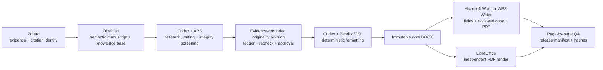

# ZOCW Evidence-to-Originality Research & Publication Workflow

[](https://github.com/zdzZDZ123/zotero-obsidian-codex-word-wps-workflow/releases/tag/v0.2.0)
[](LICENSE)
[](https://github.com/zdzZDZ123/zotero-obsidian-codex-word-wps-workflow/actions/workflows/validate.yml)
[](docs/publication-formatting.md)
[](docs/publication-formatting.md)
[](docs/originality-revision.md)

[简体中文](README.zh-CN.md)

**Zotero → Obsidian → Codex originality repair → Word/WPS, from evidence to a QA-gated submission package.**

ZOCW Research & Publication Workflow is an open, Codex-native system for
traceable academic research and deterministic manuscript delivery. Zotero owns
the evidence and citation identity, Obsidian preserves research knowledge,
Codex performs evidence-aware research and writing, and genuine Microsoft Word
or WPS Writer refreshes fields, exports PDF, and validates editor compatibility.
When ARS finds a blocking originality issue, a separate local skill traces each
repair back to Zotero evidence, preserves scientific invariants, and requires a
full changed-paragraph recheck plus named approval before formatting.

This repository distributes the workflow as a reproducible configuration and
prompt suite. It includes a sanitized Obsidian Vault, local research skills,
deployment prompts, a journal-formatting skill, audit helpers, and hard release
gates. Scientific content stays separate from layout, so changing journals
means rebuilding from semantic Markdown instead of manually restyling a DOCX.
Private Zotero libraries, licensed PDFs, credentials, commercial applications,
and third-party plugin binaries are intentionally excluded.



## What The Workflow Adds

| Stage | System | Result |
|---|---|---|
| Evidence | Zotero + Better BibTeX | Authoritative metadata, PDFs, annotations, citation keys |
| Knowledge | Obsidian | Source notes, evergreen knowledge, project state, semantic manuscript |
| Research | Codex + academic research skills | Retrieval, synthesis, drafting, review, evidence gates |
| Originality | Codex + ARS + Zotero evidence | Local report import, traceable revision copy, invariant/recheck/approval gates |
| Formatting | Codex + Pandoc/CSL | Deterministic styles, citations, tables, figures, anonymous/title-page packages |
| Compatibility | Word/WPS + LibreOffice | Field refresh, reviewed DOCX, PDF export, independent page rendering |
| Release | Codex visual QA | Privacy report, structural comparison, page images, SHA-256 manifest |

## WPS And Word Are First-Class Publication Backends

The publication layer does not merely open a generated file. It keeps an
immutable core DOCX, asks the selected editor to refresh `PAGE`, `SEQ`, `REF`,
and `TOC` fields, saves a separate reviewed copy, exports PDF, reopens the copy,
and compares its structure. `editor: auto` prefers genuine Microsoft Word only
when `Word.Application` resolves to `WINWORD.EXE`; otherwise it uses the
explicit `KWPS.Application` WPS interface. A WPS-owned `Word.Application`
registration is never misreported as Microsoft Word.

Both the editor PDF and the independent LibreOffice PDF are rasterized to page
images. A run cannot become `qa_passed` until every page has been checked for
clipping, overlap, table overflow, figure scale, captions, fonts, page numbers,
and pagination. See [Publication formatting](docs/publication-formatting.md).

### Current Publication-Backend Evidence

The 2026-08-01 validation snapshot detected WPS Office `12.1.0.28032`,
LibreOffice `26.2.4.2`, and Pandoc `3.10`. Genuine Microsoft Word was not
installed and therefore remains `not_checked`, rather than being inferred from
WPS's COM registration. A privacy-safe 27-page compatibility manuscript was
exported, reopened, structurally compared, rasterized, and inspected page by
page through both the WPS and LibreOffice paths.

Before this update was published, two additional end-to-end acceptance runs
were released as `qa_passed`: a user-defined YAML layout and an authorized
synthetic uploaded-DOCX format reference. Together they exercised 18 rendered
pages across WPS and LibreOffice, including separate title pages, citations, a
figure, a table, anonymous metadata, consecutive WPS automation, PDF export,
reopen checks, and page-by-page visual review. The uploaded-reference run also
rechecked page geometry, theme fonts, and core styles after WPS saved the
reviewed copy. See [WPS acceptance evidence](docs/wps-acceptance.md).

Users can format in three ways: select a versioned journal profile, edit their
own YAML profile, or upload an authorized DOCX/DOTX format reference. Uploaded
references are distilled read-only and can run in `template_authoritative`
mode, where page geometry and core style signatures must match both before and
after WPS produces the reviewed copy. Reference prose and identifying
header/footer text are not copied into the new manuscript.

## Evidence-Grounded Originality Revision

`revise-originality-with-evidence` consumes ARS Phase D findings and optional
reports lawfully exported by the user from CNKI, Turnitin, or iThenticate. It
does not log in to or scrape those services. The skill normalizes findings,
anchors them to stable Markdown paragraphs, requires a Zotero citation key plus
verified page/location for every repair, and generates a separate semantic copy
with a change ledger.

The deterministic helper blocks changed statistics, sample sizes, units,
protected terms, citation loss, table/figure references, headings, images, and
direct quotations. All reviewed paragraphs must then pass ARS Phase D,
citation, data, and fact checks. Only explicit named approval of the exact file
hash emits `qa_passed`; the Word/WPS formatter refuses any other state. It never
promises or optimizes for a target similarity percentage. Projects may enable
a fail-closed release policy (the starter uses `<= 10%`) over a post-revision,
hash-attested, user-exported CNKI/Turnitin/iThenticate report. A higher or stale
report blocks Word/WPS output. Reports must identify the declared vendor, be
newer than the revised manuscript, and remain within the configured age; a new
same-vendor report atomically replaces the old one and clears stale approval.
The threshold remains a policy, not a guaranteed future score. See
[Originality revision](docs/originality-revision.md).

## Responsibility Boundaries

This repository does not replace Zotero, Obsidian, Codex, Word/WPS, or the
upstream academic-research skill suite.

- Use **Zotero** for authoritative bibliographic metadata, locally available
  PDFs, annotations, and source-linked child notes.
- Use **Obsidian** for project state, reusable knowledge, research logs,
  synthesis matrices, and durable outputs.
- Use **Codex** for research routing, evidence retrieval, synthesis, drafting,
  originality remediation, review, deterministic formatting, QA, and
  controlled writes across stores.
- Use **Microsoft Word or WPS Writer** only as a compatibility and final-review
  backend. The semantic manuscript remains the source of truth.
- Use
  [`Imbad0202/academic-research-skills-codex`](https://github.com/Imbad0202/academic-research-skills-codex)
  as the Codex-native academic research engine. The Vault-local
  `run-traceable-research` skill adds this workflow's Zotero evidence and
  Obsidian handoff contract.

No Obsidian MCP server is required. Codex works directly in the Vault, while
`llm-for-zotero` provides the local bearer-protected Zotero MCP connection.

## Repository Layout

```text
obsidian/vault-template/
  AGENTS.md
  .agents/skills/
    capture-source/
    distill-knowledge/
    run-traceable-research/
    start-project/
    weekly-review/
  .obsidian/
  00-Inbox/ ... 99-Templates/
zotero/README.md
codex/README.md
prompts/01-setup-obsidian.md ... 04-run-first-research.md
prompts/05-setup-publication-formatting.md
prompts/06-setup-originality-revision.md
prompts/07-macos-sync-originality-v1.2.zh-CN.md
codex/skills/revise-originality-with-evidence/
codex/skills/format-submission-manuscript/
docs/component-lock.json
docs/architecture.md
docs/publication-formatting.md
docs/originality-revision.md
docs/security-model.md
scripts/validate-repo.ps1
scripts/Audit-ObsidianEnvironment.ps1
scripts/Audit-ObsidianEnvironment-macOS.command
scripts/Install-PublicationFormatting.ps1
scripts/Install-PublicationFormatting-macOS.command
scripts/Format-ResearchManuscript.ps1
scripts/Format-ResearchManuscript-macOS.command
scripts/Install-OriginalityRevision.ps1
scripts/Install-OriginalityRevision-macOS.command
scripts/Revise-ResearchOriginality.ps1
scripts/Revise-ResearchOriginality-macOS.command
```

## Versioning

The current workflow release is `v0.2.0`. Application and plugin baselines are
recorded independently in [`docs/component-lock.json`](docs/component-lock.json).

Pinned versions represent a tested snapshot. When a pinned release is
unavailable or incompatible, install the latest compatible official version,
record the deviation, and rerun the end-to-end acceptance test. A version
number alone is never treated as runtime evidence.

## Install The Workflow

Clone the repository on the target computer:

```bash
git clone https://github.com/zdzZDZ123/zotero-obsidian-codex-word-wps-workflow.git
cd zotero-obsidian-codex-word-wps-workflow
```

Then give the deployment prompts to Codex in order:

1. [`prompts/01-setup-obsidian.md`](prompts/01-setup-obsidian.md)
2. [`prompts/02-setup-zotero.md`](prompts/02-setup-zotero.md)
3. [`prompts/03-connect-codex.md`](prompts/03-connect-codex.md)
4. [`prompts/04-run-first-research.md`](prompts/04-run-first-research.md)
5. [`prompts/05-setup-publication-formatting.md`](prompts/05-setup-publication-formatting.md)
6. [`prompts/06-setup-originality-revision.md`](prompts/06-setup-originality-revision.md)
7. [`prompts/07-macos-sync-originality-v1.2.zh-CN.md`](prompts/07-macos-sync-originality-v1.2.zh-CN.md) — incremental Mac deployment when Zotero, Obsidian, Word, and WPS are already connected

The prompts instruct Codex to inspect the actual operating system, find each
official application/plugin source, preserve existing user data, configure the
local runtime, and validate the result. No replication ZIP or bundled installer
is required.

## Install The Academic Research Engine

This workflow expects the Codex-native ARS suite from the upstream repository.
Follow its current installation instructions, or use the baseline recorded in
`docs/component-lock.json` when reproducing this exact release.

After installation, open a new Codex conversation and verify that
`academic-research-suite` or `ARS-Codex` appears in `/skills`.

## Install The Originality Revision Layer

Run the platform installer, restart Codex, and confirm that
`revise-originality-with-evidence` appears in `/skills`.

```powershell
powershell.exe -NoProfile -ExecutionPolicy Bypass -File .\scripts\Install-OriginalityRevision.ps1
.\scripts\Revise-ResearchOriginality.ps1 doctor --self-test
```

The layer processes authorized exported reports locally and outputs semantic
Markdown, a change ledger, recheck request, disclosure draft, and a hash-bound
QA manifest. See [`docs/originality-revision.md`](docs/originality-revision.md).

## Install The Publication Layer

Run the platform installer in `scripts/`, then restart Codex and confirm that
`format-submission-manuscript` appears in `/skills`.

```powershell
powershell.exe -NoProfile -ExecutionPolicy Bypass -File .\scripts\Install-PublicationFormatting.ps1
.\scripts\Format-ResearchManuscript.ps1 doctor --self-test
```

The layer consumes semantic Markdown and Better BibTeX exports, creates an
immutable core DOCX plus a separate Word/WPS-reviewed copy, and blocks release
until every rendered page is inspected. See
[`docs/publication-formatting.md`](docs/publication-formatting.md).

## Usage

Invoke the global academic research suite together with the Vault-local
traceability layer:

```text
Use $academic-research-suite together with $run-traceable-research.

Goal: build an evidence-traceable literature review.
Evidence source: my Zotero library and locally available PDFs.
Knowledge output: source notes, evergreen notes, and a synthesis matrix in this Vault.
Constraints: preserve item identity, full-text status, and PDF page locations.
Stop condition: mark unsupported claims instead of inventing citations or pages.
```

The local skills route recurring knowledge-work operations:

| Skill | Use when you need |
|---|---|
| `capture-source` | A traceable inbox note from a new source |
| `distill-knowledge` | Atomic, reusable notes derived from captured material |
| `start-project` | A research project with done criteria and a next action |
| `run-traceable-research` | Zotero evidence inventory, ARS execution, and Obsidian handoff |
| `weekly-review` | Project-state reconciliation and one reversible improvement |

## Runtime Behavior

- Zotero remains the bibliographic source of truth.
- Obsidian remains the durable project and knowledge store.
- Codex opens the Vault as its workspace and follows `AGENTS.md` plus local
  skills before writing.
- Claudian can expose the same Codex runtime in the Obsidian sidebar, but its
  machine-specific CLI path is discovered locally.
- The Zotero MCP endpoint remains on loopback and uses a bearer token generated
  independently on every computer.
- Metadata-only access is not treated as full-text or page-level evidence.
- Missing sources, pages, statistics, and citations remain explicitly
  unverified; the workflow never manufactures them.

## Smoke Test

Configuration presence is not sufficient. A successful installation proves the
complete trace:

1. search an existing Zotero item;
2. read a real locally available PDF passage with a page or location;
3. write an Obsidian source note containing provenance and evidence status;
4. create a clearly marked Zotero test child note;
5. read the child note back;
6. validate the repository/Vault structure without exposing private content.

Expected result: every material claim can be traced to a real source, and the
workflow survives a new Codex conversation without relying on chat history.

### Gray-Box Runtime Evidence

On 2026-07-31, the installed desktop stack was checked directly with
privacy-safe views. The public Obsidian Vault opened successfully, Claudian
2.0.34 loaded with the Codex sidebar, Zotero 9.0.6 loaded the required plugins,
and `llm-for-zotero` 3.8.31 returned `OK` from its live Codex connection test.
The same screen reported a connected Zotero MCP server with 15 tools.

| Obsidian public deployment | Zotero-Codex live test |
|---|---|
|  |  |

See the complete, privacy-reviewed capture set in
[`docs/runtime-evidence.md`](docs/runtime-evidence.md), with SHA-256 digests in
[`docs/runtime-evidence-manifest.json`](docs/runtime-evidence-manifest.json).
These screenshots prove runtime loading and local connectivity; the six-step
trace above remains the release-level acceptance test for source provenance.

## Security

Do not commit Zotero profiles, private group libraries, licensed PDFs, personal
notes, unpublished manuscripts, `.env` files, OAuth state, cookies, Codex
authentication data, API keys, or the bearer token generated by
`llm-for-zotero`.

Run the public-repository gate before publishing changes:

```powershell
pwsh ./scripts/validate-repo.ps1
```

See [`SECURITY.md`](SECURITY.md) and
[`docs/security-model.md`](docs/security-model.md) for the full trust boundary.

## Third-Party Software

This repository records plugin identities, tested versions, official sources,
and sanitized settings. It does not redistribute application or plugin
binaries. See [`THIRD_PARTY_NOTICES.md`](THIRD_PARTY_NOTICES.md).

## License

Original material in this repository is released under the
[MIT License](LICENSE). Third-party products remain governed by their own
licenses and terms.
