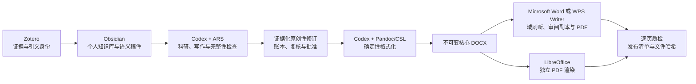
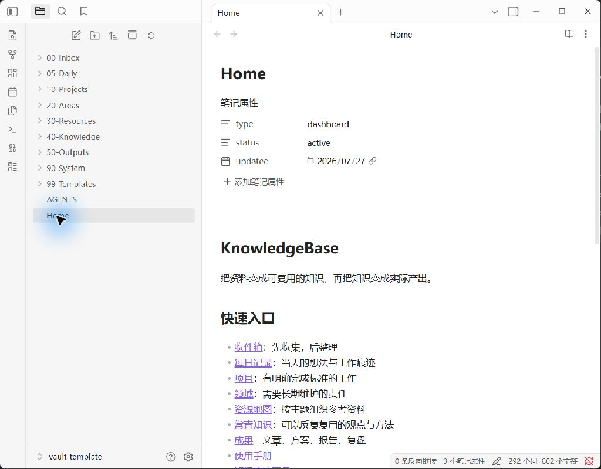
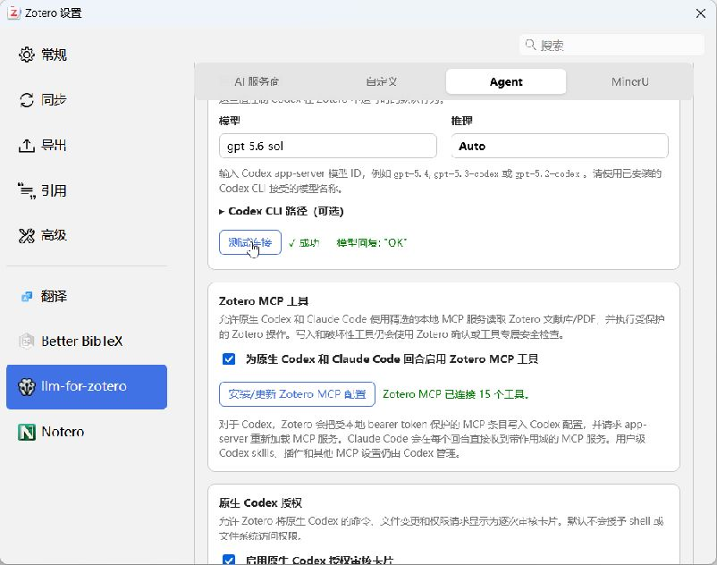

# ZOCW 证据可追溯、原创性修订与投稿工作流

[](https://github.com/zdzZDZ123/zotero-obsidian-codex-word-wps-workflow/releases/tag/v0.2.0)
[](LICENSE)
[](https://github.com/zdzZDZ123/zotero-obsidian-codex-word-wps-workflow/actions/workflows/validate.yml)
[](docs/publication-formatting.md)
[](docs/publication-formatting.md)
[](docs/originality-revision.md)

[English](README.md)

**Zotero → Obsidian → Codex 原创性修订 → Word/WPS：从真实证据一直走到可核验的投稿文件包。**

ZOCW 全自动科研与投稿工作流是一套面向 Codex 的开源科研系统。Zotero
负责文献证据和引文身份，Obsidian 负责个人知识库与语义稿件，Codex 负责检索、
综合、写作和格式化编排，真正的 Microsoft Word 或 WPS Writer 负责刷新域、生成
独立审阅副本、导出 PDF 和完成编辑器兼容性验证。
当 ARS 检出原创性阻断问题时，新增的本地技能会把每次修订重新连接到 Zotero
原文与页码，锁定科学事实，并要求全部相关段落复核和具名确认后才能进入排版。

本仓库以可复现配置、Skills、提示词和校验脚本发布整条工作流。论文内容与版式
彻底分离：更换期刊时从 Obsidian 语义稿件重新构建，不再手工逐段重排已有 DOCX。
仓库不会包含私人 Zotero 文献库、受许可限制的 PDF、账号凭据、商业软件安装包、
商业字体或受版权保护的期刊模板。



## 工作流增加了什么

| 阶段 | 系统 | 产物 |
|---|---|---|
| 证据 | Zotero + Better BibTeX | 权威元数据、PDF、批注和 citation key |
| 知识 | Obsidian | 来源笔记、永久笔记、项目状态和语义稿件 |
| 科研 | Codex + 学术研究 Skills | 检索、综合、写作、审稿和证据门禁 |
| 原创性 | Codex + ARS + Zotero 证据 | 本地报告导入、可追溯修订副本、不变量/复核/批准门禁 |
| 格式化 | Codex + Pandoc/CSL | 确定性样式、引文、表格、图片、匿名稿和标题页 |
| 兼容 | Word/WPS + LibreOffice | 域刷新、审阅 DOCX、PDF 和独立逐页渲染 |
| 发布 | Codex 视觉质检 | 隐私报告、结构比对、页面图片和 SHA-256 清单 |

## WPS 与 Word 是正式投稿后端

WPS 并不是简单地“打开 DOCX”。格式化层会保留不可变核心 DOCX，让选定编辑器
刷新 `PAGE`、`SEQ`、`REF`、`TOC` 等域，另存为独立审阅副本，导出 PDF，重新
打开副本并进行结构比对。`editor: auto` 只有在 `Word.Application` 确认真正指向
`WINWORD.EXE` 时才优先使用 Microsoft Word；否则显式调用
`KWPS.Application`。WPS 接管的 `Word.Application` 不会被误报成微软 Word。

编辑器 PDF 与 LibreOffice 独立 PDF 都会被转换为逐页图片。只有每页都检查过
裁切、重叠、表格溢出、图片尺寸、题注、字体替换、页码和分页后，运行状态才能
变为 `qa_passed`。详见[投稿格式化说明](docs/publication-formatting.md)。

### 当前投稿后端实机证据

2026-08-01 的验证快照检测到 WPS Office `12.1.0.28032`、LibreOffice
`26.2.4.2` 和 Pandoc `3.10`。本机没有安装真正的 Microsoft Word，因此状态
保持 `not_checked`，不会根据 WPS 的 COM 注册伪造 Word 验证结果。一份脱敏的
27 页兼容性回归稿已分别通过 WPS 与 LibreOffice 完成导出、重开、结构比对、
逐页图片渲染和人工逐页检查。

本次更新发布前，又完成了两条状态为 `qa_passed` 的端到端验收：用户自定义 YAML
版式，以及一份经授权的合成上传 DOCX 格式参考。两条链路合计检查了 WPS 与
LibreOffice 的 18 个渲染页面，覆盖独立标题页、引用、图片、表格、匿名元数据、
连续 WPS 自动化、PDF 导出、重开比对和人工逐页质检。上传参考链路还会在 WPS
保存审阅副本后再次核对页面几何、主题字体和核心样式。详见
[WPS 实机验收证据](docs/wps-acceptance.md)。

用户可以选择三种格式来源：使用版本化期刊规则档案、直接编辑自己的 YAML 版式，
或上传有权使用的 DOCX/DOTX 论文样式。上传文件会以只读方式提取格式；在
`template_authoritative` 模式下，页面尺寸、页边距和核心 Word 样式必须通过一致性
检查，并在 WPS 保存审阅副本后再次通过一致性检查。样稿正文及可能包含身份信息的页眉页脚不会被复制
到新论文中。

## 证据化原创性修订

`revise-originality-with-evidence` 读取 ARS Phase D 结果，也可以读取用户合法导出的
知网、Turnitin 或 iThenticate 报告；它不会登录、抓取或绕过这些平台。技能把命中
记录映射到稳定 Markdown 段落，要求每项修订带有 Zotero citation key 和已验证的
页码或位置，再生成独立语义稿与变更账本。

确定性脚本会阻止统计值、样本量、单位、受保护术语、既有引用、表图编号、标题、
图片和直接引语被悄悄改变。所有涉及段落必须重新通过 Phase D、引用、数据和事实
检查；只有对精确文件哈希进行具名批准后才会产生 `qa_passed`，Word/WPS 格式化器
会拒绝其他状态。该功能不承诺、估算或追逐某个相似度百分比。详见
[原创性修订说明](docs/originality-revision.md)。

## 四层职责边界

本仓库不会替代 Zotero、Obsidian、Codex、Word/WPS 或上游学术研究 Skills。

- 需要权威文献元数据、本地 PDF、批注和来源级子笔记时，使用 **Zotero**。
- 需要项目状态、可复用知识、研究日志、证据矩阵和长期输出时，使用 **Obsidian**。
- 需要科研任务路由、证据检索、综合、写作、原创性修订、审稿、确定性格式化和跨系统受控写入时，使用 **Codex**。
- 需要域刷新、兼容预览、审阅副本和最终 PDF 时，使用 **Microsoft Word 或 WPS Writer**；语义稿件仍是唯一内容事实源。
- Codex 原生学术研究能力来自
  [`Imbad0202/academic-research-skills-codex`](https://github.com/Imbad0202/academic-research-skills-codex)。
  Vault 内的 `run-traceable-research` 负责补充本工作流特有的 Zotero 证据与
  Obsidian 交接契约。

本工作流不要求 Obsidian MCP。Codex 直接在 Vault 中工作，`llm-for-zotero`
负责提供带本机 Bearer 保护的 Zotero MCP 连接。

## 仓库结构

```text
obsidian/vault-template/
  AGENTS.md
  .agents/skills/
    capture-source/
    distill-knowledge/
    run-traceable-research/
    start-project/
    weekly-review/
  .obsidian/
  00-Inbox/ ... 99-Templates/
zotero/README.md
codex/README.md
prompts/01-setup-obsidian.md ... 04-run-first-research.md
prompts/05-setup-publication-formatting.md
prompts/06-setup-originality-revision.md
codex/skills/revise-originality-with-evidence/
codex/skills/format-submission-manuscript/
docs/component-lock.json
docs/architecture.md
docs/publication-formatting.md
docs/originality-revision.md
docs/security-model.md
scripts/validate-repo.ps1
scripts/Audit-ObsidianEnvironment.ps1
scripts/Audit-ObsidianEnvironment-macOS.command
scripts/Install-PublicationFormatting.ps1
scripts/Install-PublicationFormatting-macOS.command
scripts/Format-ResearchManuscript.ps1
scripts/Format-ResearchManuscript-macOS.command
scripts/Install-OriginalityRevision.ps1
scripts/Install-OriginalityRevision-macOS.command
scripts/Revise-ResearchOriginality.ps1
scripts/Revise-ResearchOriginality-macOS.command
```

## 版本策略

当前工作流版本为 `v0.2.0`。应用与插件基线独立记录在
[`docs/component-lock.json`](docs/component-lock.json) 中。

锁定版本代表经过验证的快照。如果目标系统无法安装同一版本，可以安装官方来源的最新兼容版本，
但必须记录版本偏差并重新执行端到端验收。版本号本身不等于运行证据。

## 安装工作流

在目标电脑克隆仓库：

```bash
git clone https://github.com/zdzZDZ123/zotero-obsidian-codex-word-wps-workflow.git
cd zotero-obsidian-codex-word-wps-workflow
```

随后依次把以下提示词交给 Codex：

1. [`prompts/01-setup-obsidian.md`](prompts/01-setup-obsidian.md)
2. [`prompts/02-setup-zotero.md`](prompts/02-setup-zotero.md)
3. [`prompts/03-connect-codex.md`](prompts/03-connect-codex.md)
4. [`prompts/04-run-first-research.md`](prompts/04-run-first-research.md)
5. [`prompts/05-setup-publication-formatting.md`](prompts/05-setup-publication-formatting.md)
6. [`prompts/06-setup-originality-revision.md`](prompts/06-setup-originality-revision.md)

这些提示词要求 Codex 检查真实操作系统、从官方来源查找应用和插件、保护已有用户数据、
配置本机运行环境并完成运行验证。不需要复刻 ZIP 或预打包安装程序。

## 安装学术研究引擎

本工作流依赖上游仓库提供的 Codex 原生 ARS 套件。安装时应遵循其当前说明；
若要精确复现本版本，则使用 `docs/component-lock.json` 中记录的基线。

安装后打开新的 Codex 对话，通过 `/skills` 确认出现
`academic-research-suite` 或 `ARS-Codex`。

## 安装原创性修订层

运行对应平台的安装器，重启 Codex 后确认 `/skills` 中出现
`revise-originality-with-evidence`。

```powershell
powershell.exe -NoProfile -ExecutionPolicy Bypass -File .\scripts\Install-OriginalityRevision.ps1
.\scripts\Revise-ResearchOriginality.ps1 doctor --self-test
```

该层只在本机处理用户授权导出的报告，输出语义 Markdown、变更账本、复核请求、
披露草稿和绑定文件哈希的 QA 清单。说明见
[`docs/originality-revision.md`](docs/originality-revision.md)。

## 安装 Word/WPS 投稿层

运行 `scripts/` 中对应平台的安装器，重启 Codex 后确认 `/skills` 中出现
`format-submission-manuscript`。

```powershell
powershell.exe -NoProfile -ExecutionPolicy Bypass -File .\scripts\Install-PublicationFormatting.ps1
.\scripts\Format-ResearchManuscript.ps1 doctor --self-test
```

该层读取 Obsidian 语义稿件和 Better BibTeX 自动导出，生成不可变核心 DOCX、
独立 Word/WPS 审阅副本、PDF 和逐页质检材料。安装及使用说明见
[`docs/publication-formatting.md`](docs/publication-formatting.md)，自动部署提示词见
[`prompts/05-setup-publication-formatting.md`](prompts/05-setup-publication-formatting.md)。

## 使用方式

同时调用全局学术研究套件和 Vault 本地的可追溯交接层：

```text
使用 $academic-research-suite 和 $run-traceable-research。

目标：完成一份证据可追溯的文献综述。
证据来源：我的 Zotero 文献库及本地可读取 PDF。
知识输出：在当前 Vault 中生成来源笔记、永久笔记和证据矩阵。
约束：保留 Zotero 条目身份、全文状态及 PDF 页码位置。
停止条件：证据不足时标记为未验证，不得虚构引文或页码。
```

五个本地 Skills 分别负责：

| Skill | 适用任务 |
|---|---|
| `capture-source` | 把新来源捕获为可追溯的收件箱笔记 |
| `distill-knowledge` | 从来源材料中提炼原子化、可复用知识 |
| `start-project` | 建立带完成标准与下一步行动的科研项目 |
| `run-traceable-research` | Zotero 证据盘点、ARS 执行和 Obsidian 交接 |
| `weekly-review` | 对齐项目状态并实施一个可逆改进 |

## Codex 运行行为

- Zotero 始终是文献元数据与附件证据的事实源。
- Obsidian 始终是项目控制和长期知识存储层。
- Codex 把 Vault 作为工作区，并在写入前遵守 `AGENTS.md` 和本地 Skills。
- Claudian 可以在 Obsidian 侧栏中调用同一 Codex 运行时，但必须发现目标电脑自己的 CLI 路径。
- Zotero MCP 仅监听本机回环地址，每台电脑独立生成 Bearer Token。
- 只能读取元数据时，不得声称已经读取全文或获得页码证据。
- 无法核验的来源、页码、统计数据与引文必须明确标记，不能补造。

## 冒烟测试

只有配置文件存在并不代表安装成功。完整验收必须证明以下链路：

1. 搜索一个真实 Zotero 条目；
2. 从本地可用 PDF 中读取真实段落和页码或位置；
3. 向 Obsidian 写入包含来源和证据状态的来源笔记；
4. 创建一个明确标记的 Zotero 测试子笔记；
5. 再次读取该子笔记；
6. 在不暴露私人内容的情况下完成仓库与 Vault 结构校验。

预期结果是：每个重要论断都能回溯到真实来源，而且在开启新的 Codex 对话后，
工作流仍可依靠持久化知识继续运行，而不是依赖旧聊天记录。

### 灰度运行证据

2026-07-31 对本机已安装的桌面环境进行了隐私安全的实机检查：公开 Obsidian
Vault 成功打开，Claudian 2.0.34 已加载并显示 Codex 侧栏，Zotero 9.0.6 已加载
所需插件，`llm-for-zotero` 3.8.31 的实时 Codex 连接测试返回 `OK`，同一页面还
显示 Zotero MCP 已连接并注册 15 个工具。

| Obsidian 公开部署 | Zotero-Codex 实时测试 |
|---|---|
|  |  |

完整的脱敏截图与证据边界见
[`docs/runtime-evidence.md`](docs/runtime-evidence.md)，原始 PNG 的 SHA-256 摘要见
[`docs/runtime-evidence-manifest.json`](docs/runtime-evidence-manifest.json)。这些截图
证明插件已实际加载且本地连接可用；上面的六步链路仍是来源可追溯性的发布级验收。

## 安全边界

不要提交 Zotero Profile、私人群组库、受许可限制的 PDF、个人笔记、未发表论文、
`.env`、OAuth 状态、Cookie、Codex 登录数据、API Key 或 `llm-for-zotero`
生成的 Bearer Token。

发布修改前运行：

```powershell
pwsh ./scripts/validate-repo.ps1
```

完整信任边界见 [`SECURITY.md`](SECURITY.md) 和
[`docs/security-model.md`](docs/security-model.md)。

## 第三方软件

本仓库只记录插件身份、验证版本、官方来源和脱敏设置，不重新分发应用或插件二进制。
详见 [`THIRD_PARTY_NOTICES.md`](THIRD_PARTY_NOTICES.md)。

## 许可证

本仓库原创内容采用 [MIT License](LICENSE)。第三方产品继续遵循各自许可证和使用条款。
