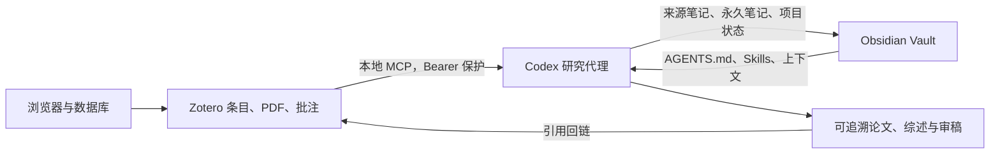

# Zotero × Obsidian × Codex 全自动化科研工作流

[English](README.md)

这是一套可公开、可审计、可在另一台电脑复现的科研工作流：

- **Zotero** 保存论文、附件、元数据与引用关系，是文献事实源；
- **Obsidian** 保存项目、原子知识、研究日志与输出，是长期个人知识库；
- **Codex** 负责检索、证据读取、综合、写作、审稿和跨系统交接。

仓库公开的是方法、配置契约、提示词、模板和本地 Skills，不公开个人论文库、PDF、笔记正文、账号、OAuth 状态、MCP Bearer Token、Cookie 或第三方插件二进制。

## 核心优点

- **来源可追溯**：重要论断保留到 Zotero 条目、全文状态和页码证据的链路。
- **知识可积累**：研究结果不只停留在对话里，而是沉淀为 Obsidian 项目、来源笔记和永久笔记。
- **系统各司其职**：Zotero 管证据，Obsidian 管知识与项目，Codex 管推理与执行。
- **可迁移**：目标电脑让 Codex 按提示词自行查找官方插件、安装并配置，不依赖某个预打包安装包。
- **隐私边界清楚**：公开仓库与个人同步数据分离；任何电脑都必须生成自己的登录态和令牌。
- **有完成定义**：以真实 PDF 页码读取、Obsidian 可追溯写入、Zotero 测试笔记回读作为端到端验收。

## 最快部署方式

在目标电脑克隆本仓库后，依次把以下提示词交给 Codex：

1. [`prompts/01-setup-obsidian.md`](prompts/01-setup-obsidian.md)：安装 Obsidian、官方来源插件并建立 Vault。
2. [`prompts/02-setup-zotero.md`](prompts/02-setup-zotero.md)：安装 Zotero、Connector 与四个插件。
3. [`prompts/03-connect-codex.md`](prompts/03-connect-codex.md)：打通 Zotero MCP、Vault 文件系统和 Claudian。
4. [`prompts/04-run-first-research.md`](prompts/04-run-first-research.md)：完成真实的三方闭环验收。

基线版本和插件 ID 见 [`docs/component-lock.json`](docs/component-lock.json)。若目标系统不能安装完全相同的版本，可以安装官方来源的最新兼容版本，但必须在部署报告中列出偏差、原因和验证结果。

## 工作流



## 仓库结构

```text
obsidian/vault-template/   Vault 骨架、模板、脱敏设置和 5 个本地 Skills
zotero/                    Zotero 配置契约与隐私边界
codex/                     Codex 安装、MCP、Claudian 和运行规范
prompts/                   在另一台电脑执行的四阶段提示词
docs/                      架构、版本矩阵、安全模型、故障排查
scripts/                   Windows/macOS 审计脚本与仓库安全校验
```

## 这不是完整镜像

“功能一致”不等于复制个人状态。下列内容必须由每位使用者自己创建或同步：

- Zotero 账号与 Zotero Sync 数据；
- 有权访问的论文 PDF；
- Obsidian Sync、Git 或其他同步账号；
- Codex 登录态和本机可执行文件路径；
- `llm-for-zotero` 生成的本机 MCP Bearer Token；
- 第三方模型 API Key。

这能避免令牌泄漏、许可冲突和错误地公开私人研究材料。

## 许可证

本仓库原创内容采用 [MIT License](LICENSE)。第三方软件不包含在仓库中，分别遵循各自许可证。详见 [`THIRD_PARTY_NOTICES.md`](THIRD_PARTY_NOTICES.md)。
