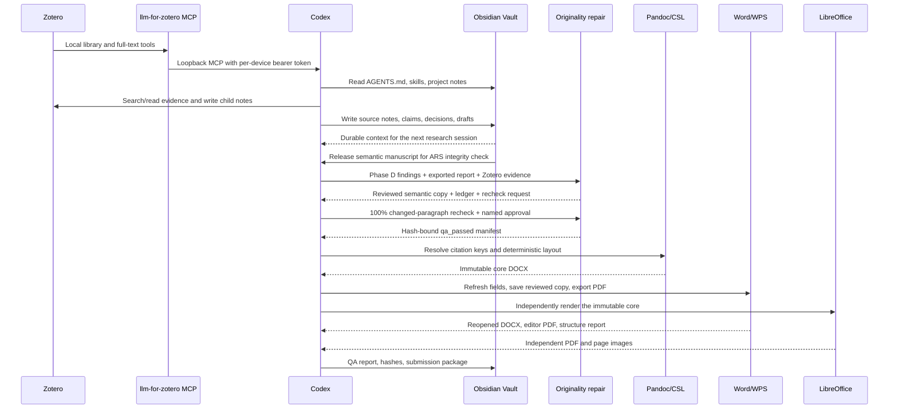

# ZOCW Architecture

## Responsibility boundaries

| Layer | System of record | Owns | Does not own |
|---|---|---|---|
| Evidence | Zotero | Bibliographic metadata, PDFs, annotations, source-linked notes | Project planning and durable synthesis |
| Knowledge | Obsidian | Project control, source notes, evergreen notes, research logs, outputs | Authoritative bibliographic metadata |
| Orchestration | Codex | Retrieval, synthesis, drafting, review, cross-system operations | Long-term private data storage |
| Originality repair | Codex originality skill + ARS | Evidence-grounded semantic revision, change ledger, integrity recheck | Vendor verdicts, score targeting, layout |
| Formatting | Codex publication skill + Pandoc | Deterministic layout, citation rendering, QA manifests | Scientific content or bibliographic invention |
| Compatibility | Word/WPS + LibreOffice | Field refresh, editor PDF, independent page rendering | Authoritative semantic source |

## Connections

Claudian embeds Codex in the Obsidian sidebar, but the durable integration is still the Vault filesystem. No Obsidian MCP server is required.

When Phase D finds a blocking originality issue,
`revise-originality-with-evidence` creates a separate semantic review copy and
requires verified Zotero locations, scientific-invariant checks, a full recheck,
and named approval. It does not replace the upstream ARS detector and does not
claim an official vendor score.

After the research manuscript clears both evidence and originality gates,
`format-submission-manuscript` adds a one-way release path: semantic Markdown to
immutable core DOCX, a separate editor-reviewed copy, independent PDF renders,
and explicit page-by-page QA. Switching journals always starts again from the
approved semantic source.

## Traceability contract

For any material claim, record as much of the following as the source supports:

- Zotero item identity and bibliographic metadata;
- DOI/URL or library key;
- whether full text was actually available;
- PDF page or exact location when quoting or making a page-specific claim;
- the distinction between source statement, researcher inference, and draft prose;
- uncertainty or missing evidence.

If the full text or page is unavailable, Codex must stop at metadata-level claims and label the limitation. It must never manufacture a quotation, page number, result, or citation.
