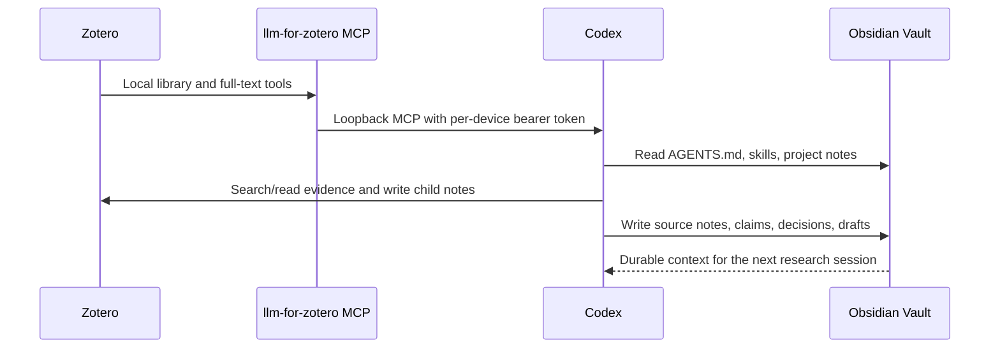

# Architecture

## Responsibility boundaries

| Layer | System of record | Owns | Does not own |
|---|---|---|---|
| Evidence | Zotero | Bibliographic metadata, PDFs, annotations, source-linked notes | Project planning and durable synthesis |
| Knowledge | Obsidian | Project control, source notes, evergreen notes, research logs, outputs | Authoritative bibliographic metadata |
| Orchestration | Codex | Retrieval, synthesis, drafting, review, cross-system operations | Long-term private data storage |

## Connections

Claudian embeds Codex in the Obsidian sidebar, but the durable integration is still the Vault filesystem. No Obsidian MCP server is required.

## Traceability contract

For any material claim, record as much of the following as the source supports:

- Zotero item identity and bibliographic metadata;
- DOI/URL or library key;
- whether full text was actually available;
- PDF page or exact location when quoting or making a page-specific claim;
- the distinction between source statement, researcher inference, and draft prose;
- uncertainty or missing evidence.

If the full text or page is unavailable, Codex must stop at metadata-level claims and label the limitation. It must never manufacture a quotation, page number, result, or citation.
