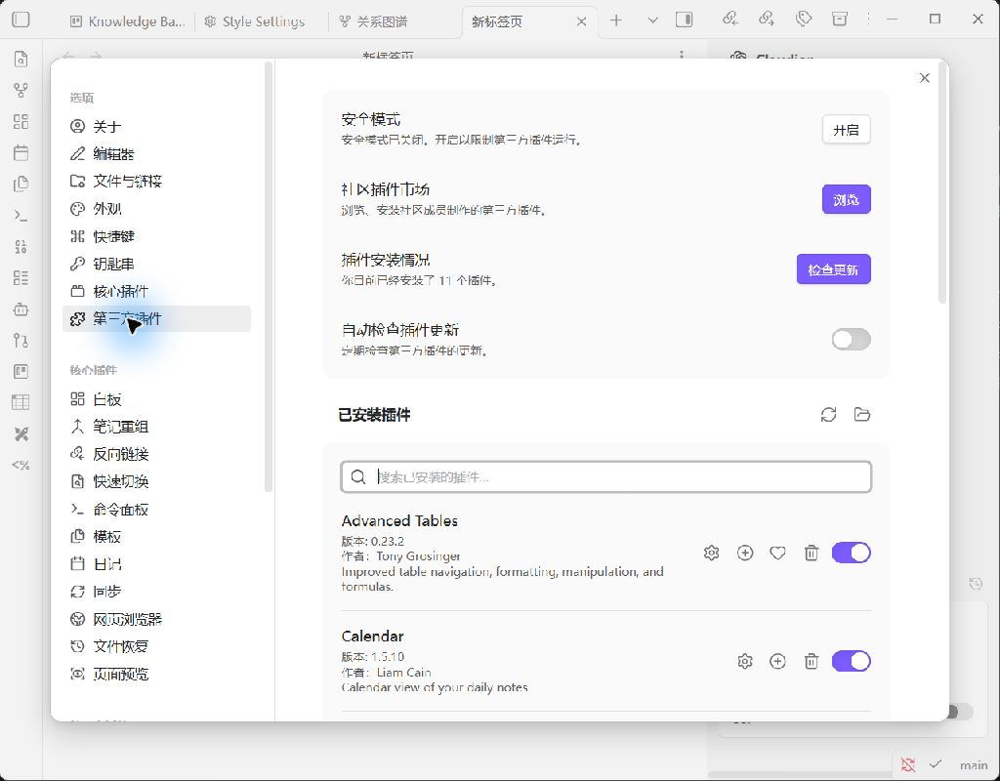
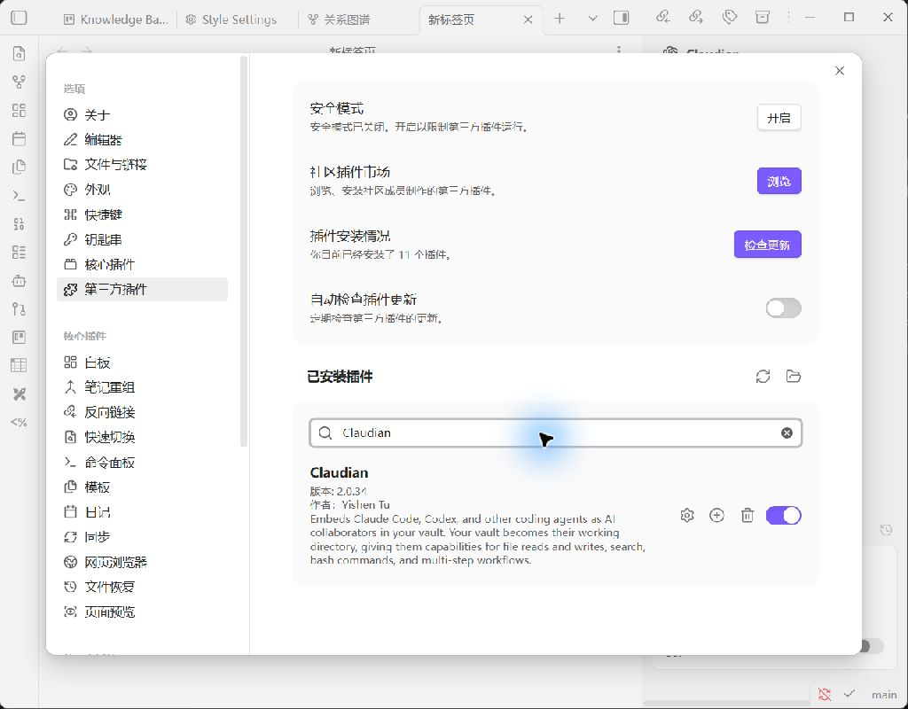
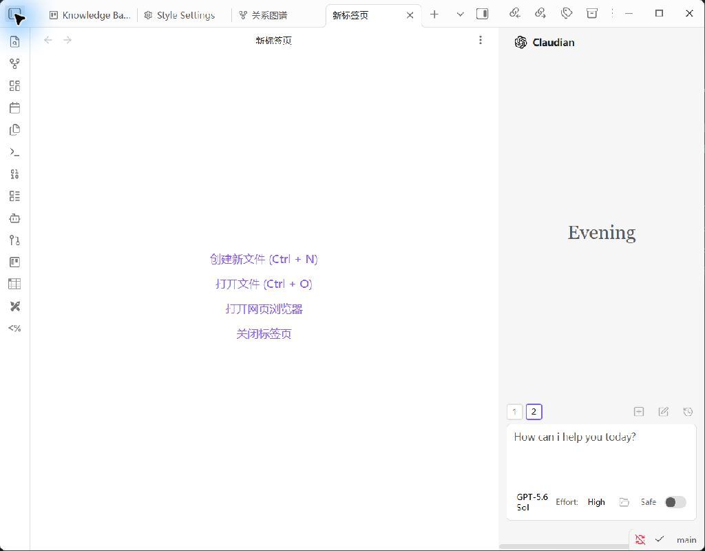
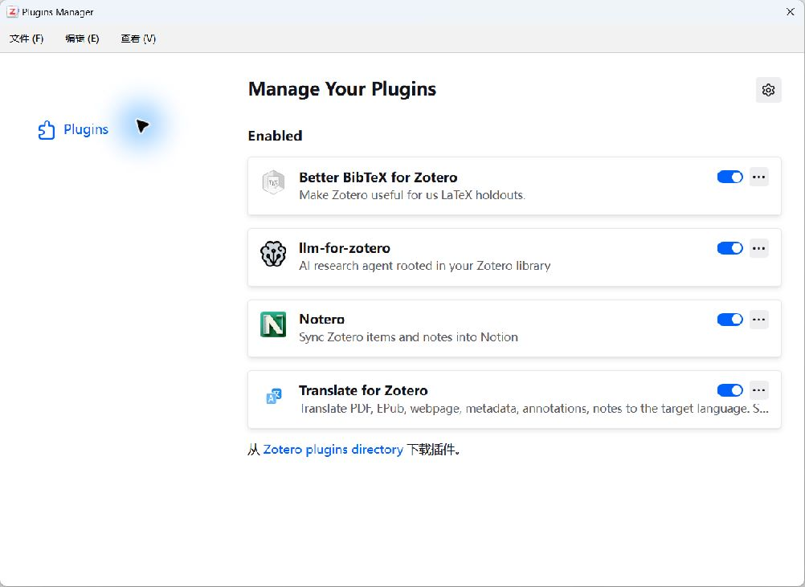
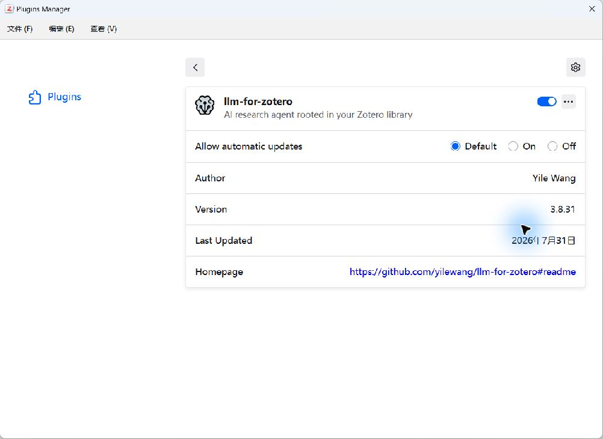
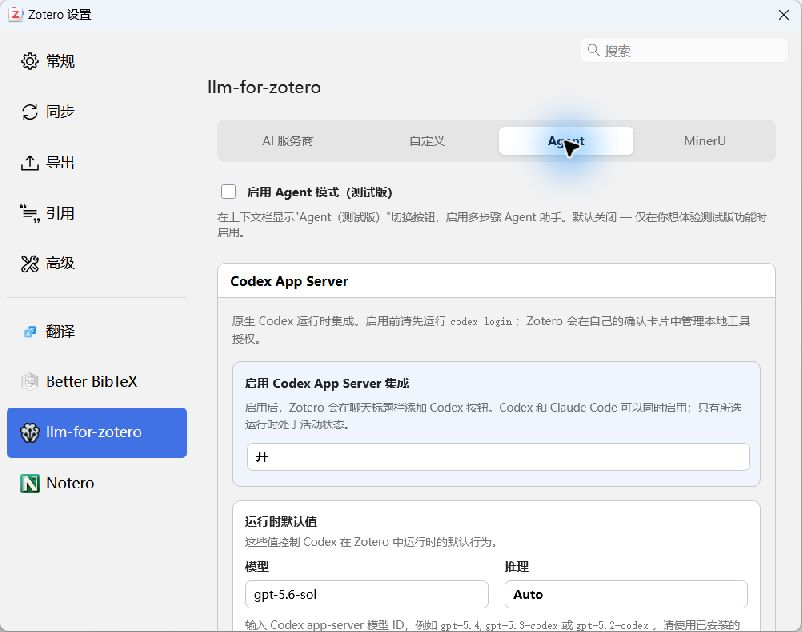

# Gray-Box Runtime Evidence

This page records a live, privacy-safe runtime check of the workflow. The
screenshots were captured directly from the installed desktop applications on
2026-07-31 (Asia/Shanghai); they are not mockups and were not generated from
the repository configuration files.

## Result Summary

| Check | Result | Runtime evidence |
|---|---|---|
| Public Obsidian Vault opens | Pass | The repository's public `vault-template` opens with its folder structure and `Home` dashboard. |
| Obsidian community-plugin runtime | Pass | Obsidian reports 11 installed community plugins with restricted mode disabled; Claudian 2.0.34 is enabled. |
| Obsidian-to-Codex surface | Pass | The Claudian sidebar loads and exposes the configured Codex model and reasoning controls. |
| Zotero application runtime | Pass | Zotero 9.0.6 (64-bit) is running. |
| Zotero plugin runtime | Pass | Better BibTeX, `llm-for-zotero`, Notero, and Translate for Zotero are enabled. |
| Zotero-to-Codex configuration | Pass | `llm-for-zotero` 3.8.31 has Codex App Server integration enabled with the configured `gpt-5.6-sol` model. |
| Codex CLI connection test | Pass | The plugin's live test returned `OK`. |
| Zotero MCP registration | Pass | The plugin reports a connected Zotero MCP server with 15 tools. |

## Core Evidence

### 1. Public Vault deployment

The screenshot uses only the public Vault template included in this repository.
It demonstrates that a clean Obsidian instance can open the supplied structure
and dashboard.

### 2. Obsidian plugin and Codex runtime

These views demonstrate runtime loading, not merely the presence of plugin IDs
in `community-plugins.json`.

### 3. Zotero plugin runtime

### 4. Zotero-Codex connectivity

The final screenshot is the strongest gray-box signal in this set: it shows the
plugin's live Codex test returning `OK` and the Zotero MCP server connected with
15 registered tools.

## Evidence Boundary

This capture proves that the public Vault opens, the relevant desktop plugins
load, and the local Zotero-Codex bridge answers a live connection test. It does
not replace the full six-step acceptance trace in the README. A release claim
that includes page-level evidence, Obsidian note creation, Zotero child-note
round-tripping, or citation accuracy must still run and record those steps
against a lawful local test document.

## Privacy and Integrity

- Screenshots use the public Vault template or settings-only views.
- Personal Zotero item titles, private notes, licensed PDF pages, absolute user
  paths, API keys, OAuth data, and MCP bearer tokens are excluded.
- No plugin binaries or application data are committed.
- SHA-256 digests for the original PNG files are recorded in
  [`runtime-evidence-manifest.json`](runtime-evidence-manifest.json).
